# Farm-Monitor-Show-Case
Farm monitor is a remote agro-project management and monitoring platform built for Africa.

It is an all-in-one platform that keeps track of the performance and productivity of farms, ensuring that farm owners, financiers and stakeholders have real-time visibility into their project.

Farmers are provided with Good Agricultural Practices (GAP), informed on their crop health state and provide remediation strategy to help them make critical decisions across key production area.

## Showcase
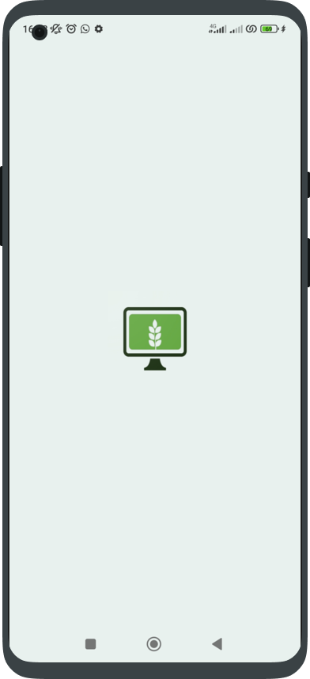 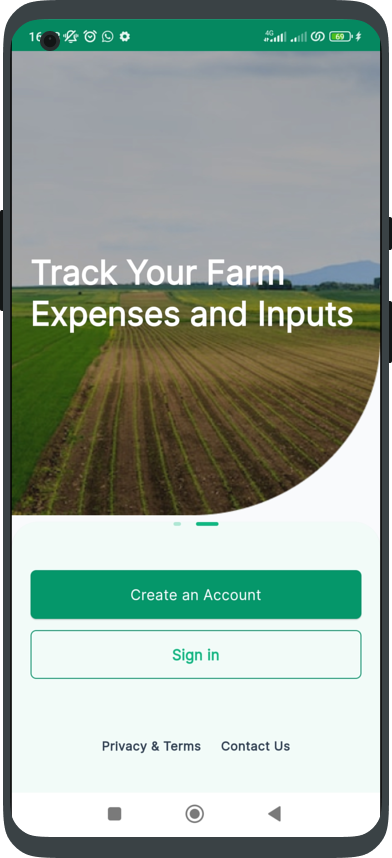 

 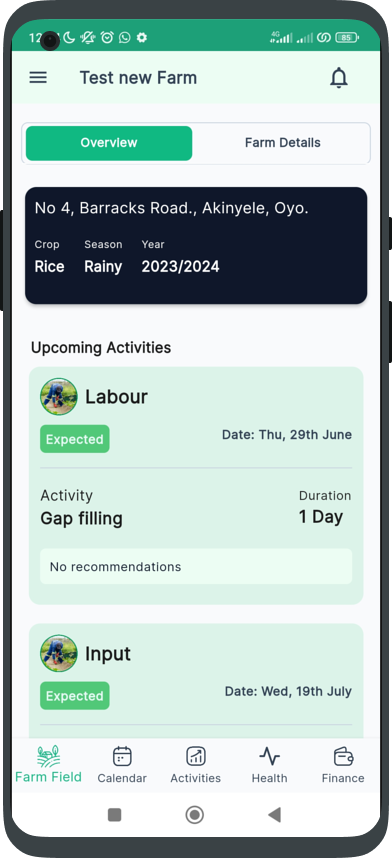 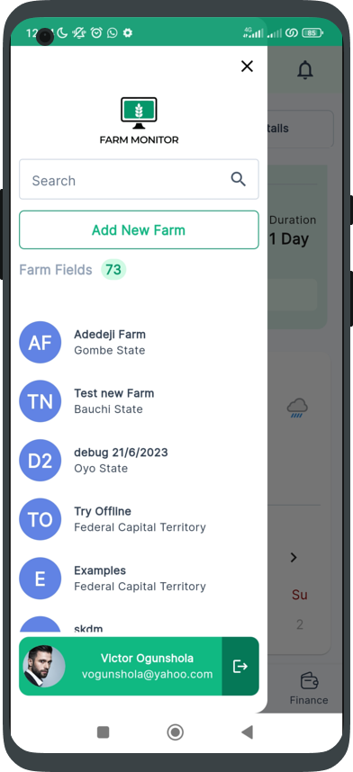
 
 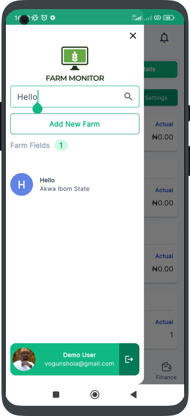 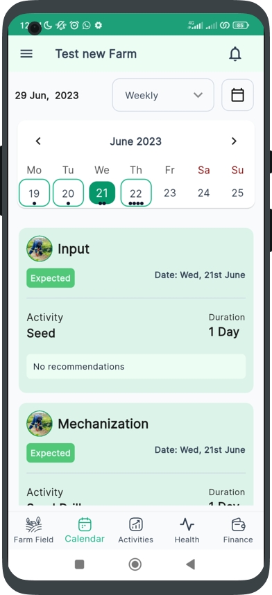

 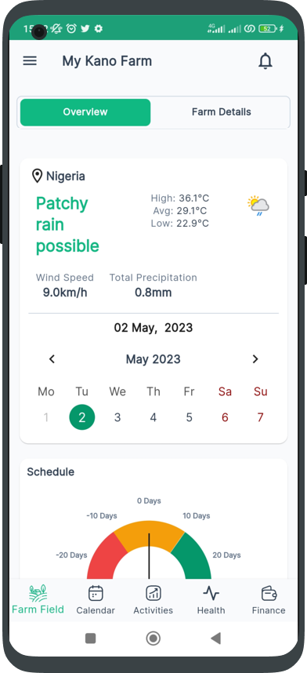 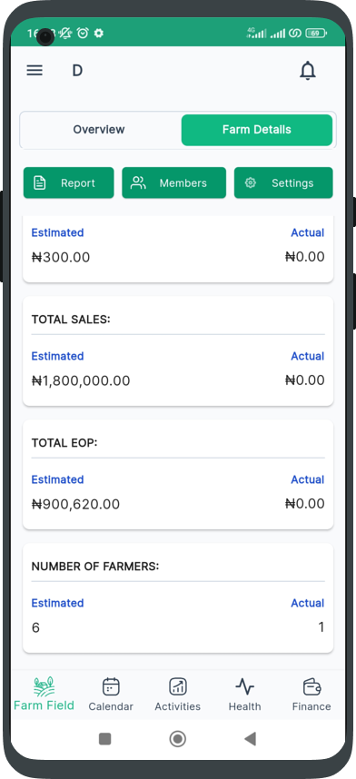 

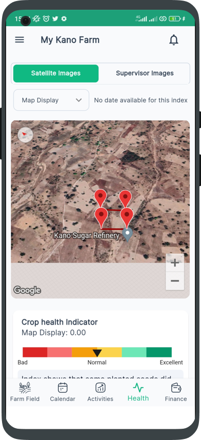 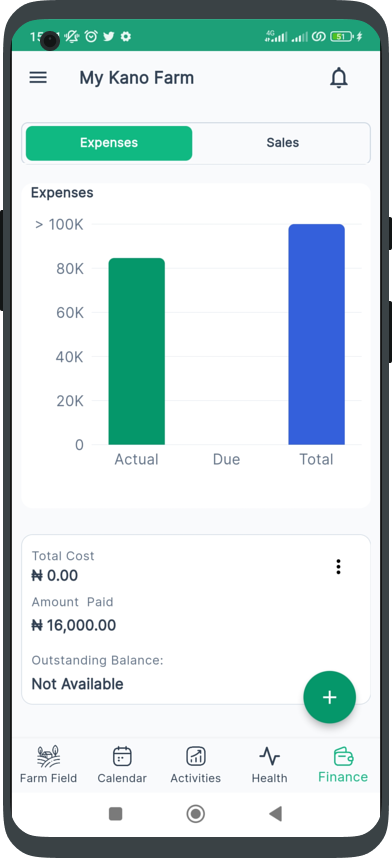 

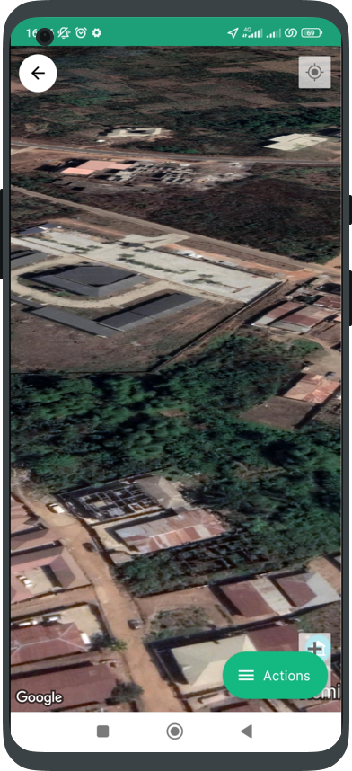 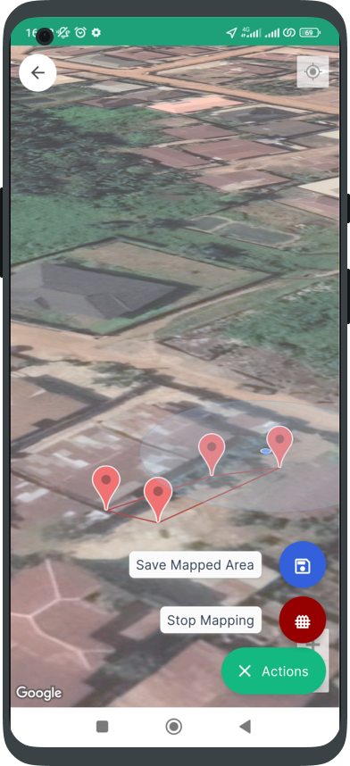

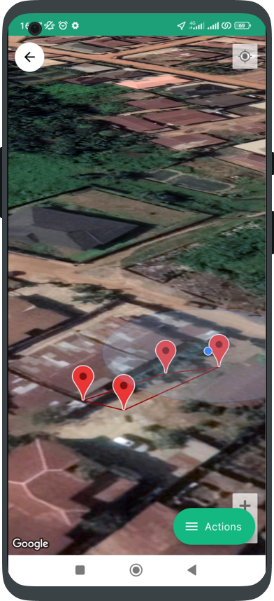 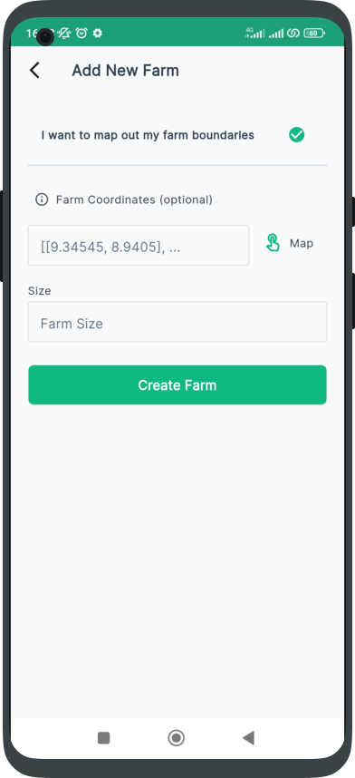

 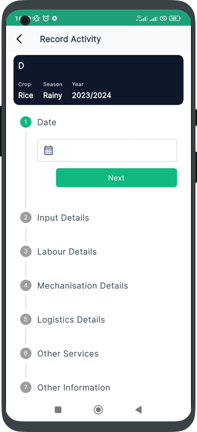 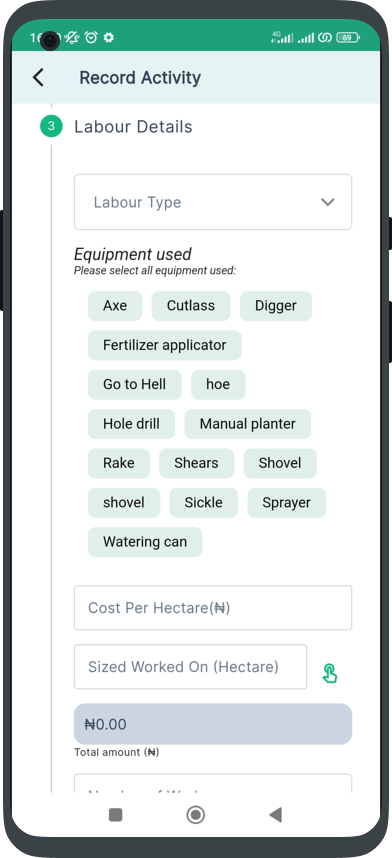

